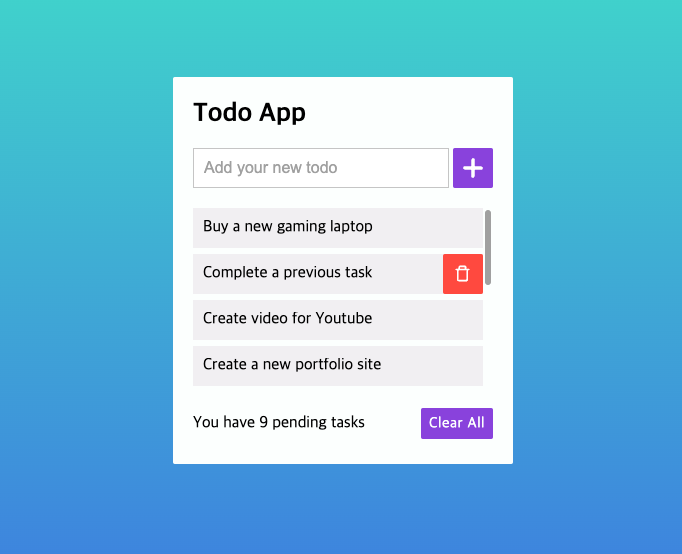
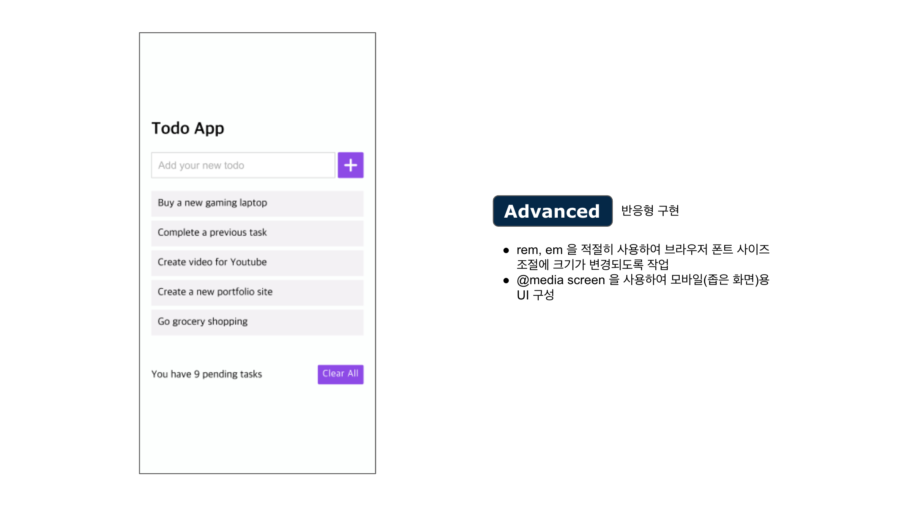

# todo-app-assignment
프론트엔드 입문자를 위한 Todo App 만들기 과제

[](https://skillicons.dev)
---



이 프로젝트는 실행 및 배포를 위해 패키지 매니저 [yarn](https://classic.yarnpkg.com/en/) 을 사용합니다.
* [패키지 매니저란?](https://github.com/ssafy-tech-concert/ssafy-tech-concert/blob/master/Front-end/npm%26yarn.md)
* [Yarn 설치 및 사용법](https://heropy.blog/2017/11/25/yarn/)

### 실행
```bash
yarn start
```
### 배포
github.io 에 작업물을 배포하기 위해 [gh-pages](https://medium.com/hcleedev/web-react-%ED%94%84%EB%A1%9C%EC%A0%9D%ED%8A%B8-github-pages%EB%A1%9C-%EB%B0%B0%ED%8F%AC%ED%95%98%EA%B8%B0-f62e59a2e210) 로 빌드 브랜치를 생성합니다.
선행 작업으로 package.json 의 homepage 를 본인의 github.io 레포지토리 주소로 변경해주어야 합니다.
```bash
yarn deploy
```

## HTML + CSS 작성
- 기한: 7일
- [디자인 (피그마)](https://www.figma.com/file/AEQcuWYaKrjdaKQxUgY431/Todo-App?type=design&node-id=0%3A1&t=Zkn6QcM0KkwDh5v4-1)
- 유용한 강의
  - [노마드 코더 코코아톡 클론코딩](https://nomadcoders.co/kokoa-clone) (유료)
- 유용한 문서
  - [CSS Flex(Flexible Box) 완벽 가이드](https://heropy.blog/2018/11/24/css-flexible-box/)

## 요구 사항


